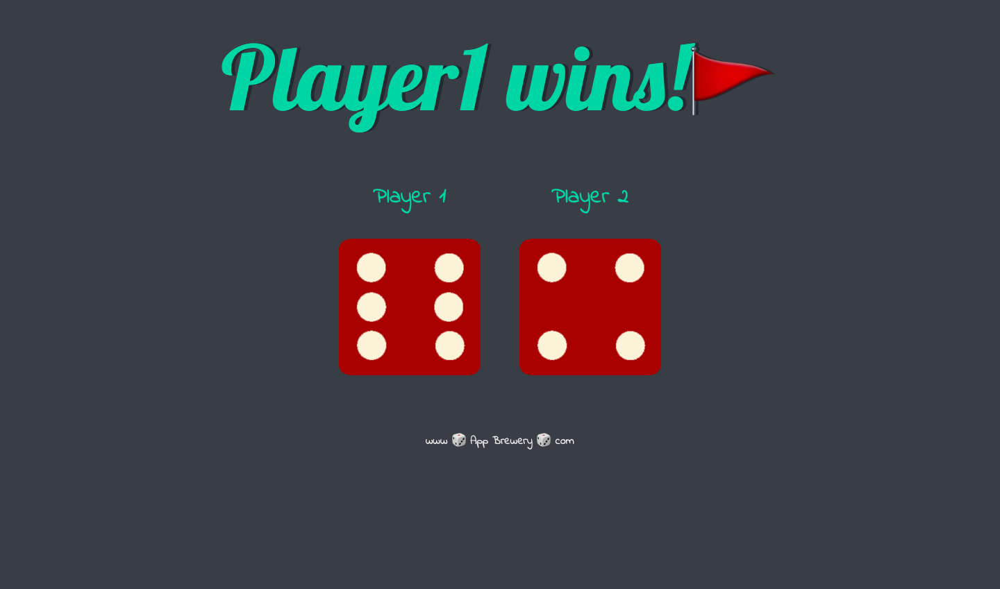
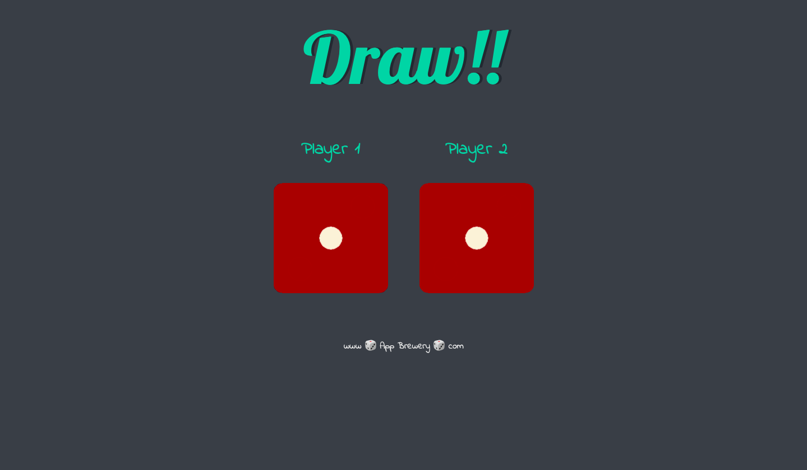
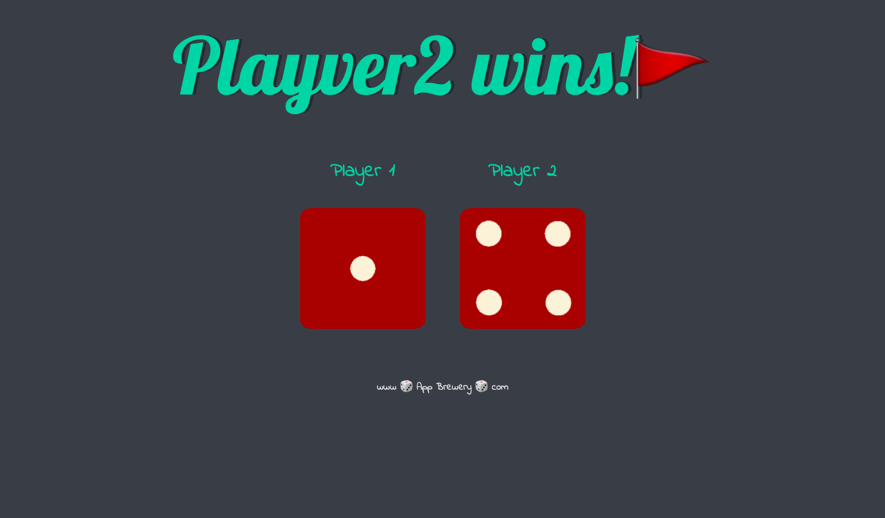

# The Dice Game

Welcome to The Dice Game project! This is a simple JavaScript, HTML, and CSS project where two dice are rolled upon reloading the page, and random numbers appear on them. The game determines the winner based on which die has a greater number. If the number on the first die is greater, Player 1 wins. If the number on the second die is greater, Player 2 wins. If both dice show the same number, it's a draw.

## How to Play

1. Open the `index.html` file in your web browser.
2. Upon loading the page, two dice will be rolled automatically, displaying random numbers.
3. The game will determine the winner based on the numbers shown on the dice.
4. If the number on the first die is greater, Player 1 wins.
5. If the number on the second die is greater, Player 2 wins.
6. If both dice show the same number, it's a draw.

## Technologies Used

- **HTML**: The structure of the webpage.
- **CSS**: Styles for the appearance of the webpage.
- **JavaScript**: Logic for rolling the dice and determining the winner.

## Files Included

- `index.html`: The main HTML file containing the structure of the webpage.
- `styles.css`: CSS file for styling the webpage.
- `script.js`: JavaScript file containing the logic for rolling the dice and determining the winner.

## Preview

  
  
  

## Deployed Version

You can play the game online [here](https://akshar625.github.io/The_Dice_Game/).

## Acknowledgments

This project was created as a simple demonstration of JavaScript, HTML, and CSS. It's a fun way to understand basic concepts like random number generation and conditional statements. Feel free to modify and improve upon it as you see fit!

Enjoy playing The Dice Game! 🎲🎉
